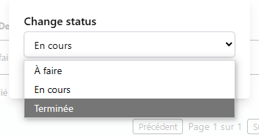

# TeamTask - Application de Gestion des Tâches

TeamTask est une application MERN (MongoDB, Express, React, Node.js) permettant aux équipes de collaborer efficacement sur des taches, avec gestion des rôles (utilisateur / manager ), authentification sécurisée via JWT, gestion d'etat avec Redux Toolkit, et interface utilisateur moderne avec Tailwind CSS.

## Compte admin :

pour accedé comme admin et visualiser la liste des utilisateur :

-email: teamtask.admin@gmail.com
-password: admin

---

## Fonctionnalités

- Authentification JWT (inscription, connexion, déconnexion)
- Middleware de sécurité :
  `hpp` Contre les requettes http pollué,
  `express-mongo-sanitize` Contre les injections SQL
- Gestion d'etat avec : `Redux Toolkit`
- Gestion des rôles : `user`, `manager`
- Notifié avec email les utilisateur à propos leur nouveau taches avec : `nodemailer`
- CRUD des tâches
- Filtrage des tâches par statut
- Tableau de bord tache
- Ajoute des taches
- Tableau de bord utilisateur pour l'admin
- UI avec Tailwind CSS

---

## Installation

### 1. Cloner le dépôt

```bash
git clone https://github.com/yassinebouzid11/TeamTask.git
cd teamtask
```

### 2. Backend

```bash
cd server
npm install
```

Créer un fichier `.env` directement sous le dossier server :

```
DATABASE_URI="Mettre ton mongodb_connection_string"
ACCESS_TOKEN_SECRET="d99aee20e6da1b454da3830718fba56361ac509144bad8820a8a6e648945dad9"
PORT=5000
```

Puis :

```bash
npm run dev
```

### 3. Frontend

```bash
cd client
npm install
npm run dev
```

---

## Stack technique

- **Frontend** : React + Vite + Tailwind CSS + Redux Toolkit
- **Backend** : Node.js + Express + MongoDB + Mongoose
- **Sécurité** : JWT, bcrypt, express-mongo-sanitize, hpp
- **Déploiement suggéré** : Vercel (frontend) / Render ou Railway (backend)

---

## Capture

1. voici la page signup:
   

2. voici la page login:
   

3. connecter en temp que manager, voici la liste des taches:
   

3.1. voici le filtre des status:


3.2. filtre par status " en cours ":


3.4. voici le boutton "add a task" qui est responsable d'afficher la formulaire d'ajout:


3.5. voici le formulaire d'ajout:


3.6. voici la list des utilisateurs disponibles pour assigné la tache:


4.connecter en temp que user, voici la liste des taches:


4.1.changer la status de la tache:


4.2.les status possibles:


5. connecter en temp que admin, voici la liste des utilisateurs:
   

5.1. filtre les utilisateurs par role :


6. en cliquant sur le profile on peut deconnecté :
   

---

## Licence

MIT © 2025 [Yassine bouzid]
